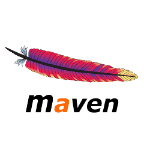
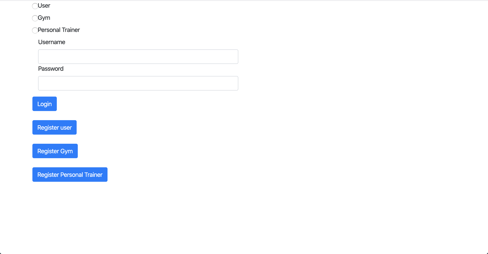

# ASSIGNMENT 3 - Gym Sharing
## Membri
+ Andrea Carubelli 803192
+ Gianmaria Balducci 807141

## Link repository
+  Gitlab : `https://gitlab.com/jiimmy.exe/2019_assignment3_gym_sharing`
+  Il progetto è stato sviluppato con il framework `SpringBoot-MVC` attraverso `Visual Studio Code`.

## Setup Ambiente
+ SpringBoot-MVC `1.5.1`
+ Java version `1.8.0_111`
+ OpenJDK `11.0.5`
+ Sistema operativo: `Mac OS Catalina 10.15` e `Linux Ubuntu Pop!_OS 19.10`
+ Maven Version: `3.6.3`

## Requisiti
+ Java, reperibile al link `https://www.java.com/it/download/`
+ Maven

## Apache Maven plugin

### Installare Maven su Ubuntu
+ `sudo apt install maven`

### Installare Maven su Mac
+ `https://maven.apache.org/install.html`

## Avviare la web app
+ Clonare la repository localmente con:
    + `https://gitlab.com/jiimmy.exe/2019_assignment3_gym_sharing.git`
+ Andare nella directory corretta: 
    + `gymsharingapp`
+ Avviare il comando: `mvn package`
    + Se viene presentato qualche errore sui test eseguire: `mvn package -Dmaven.test.skip=true`
+ Avviare il comando `mvn spring-boot:run` per avviare l'applicazione
+ Andare all'indirizzo: `localhost:8080` sul proprio browser
+ Verrai indirizzato alla homepage della webapp

## Accesso
+ Per loggarsi come utente:
    + `username`: andrea
    + `password`: andreapsw
+ Per loggarsi come personal trainer:
    + `username`: gimmy
    + `password`: gimmypsw
+ Per loggarsi come palestra:
    + `username`: MaxiFit
    + `password`: maxipsw

+ Per loggarsi con altre utenze, guardare il file `Assignement3Application.java`